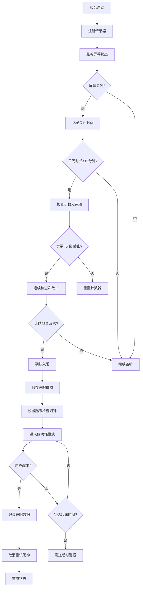
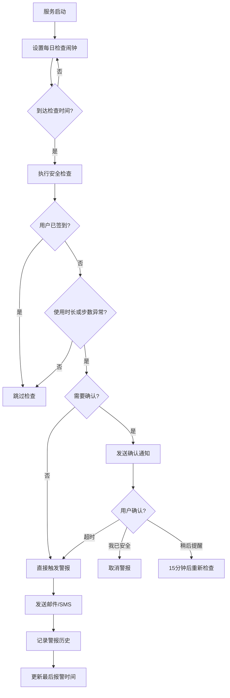
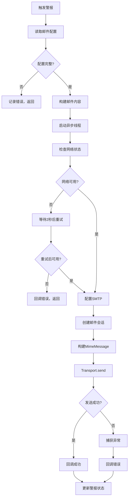

# 活着呢 (HuoZheNe) Android 应用 - 项目架构文档

> **版本**: v1.0  
> **最后更新**: 2026-04-15  
> **技术栈**: Kotlin + Android SDK + Gradle

---

## 📋 目录

1. [项目概述](#项目概述)
2. [技术架构](#技术架构)
3. [核心功能模块](#核心功能模块)
4. [数据流与持久化](#数据流与持久化)
5. [服务与后台机制](#服务与后台机制)
6. [关键业务流程](#关键业务流程)
7. [已知问题与修复方向](#已知问题与修复方向)
8. [开发规范](#开发规范)

---

## 项目概述

### 项目名称
**活着呢 (HuoZheNe)** - 一款健康守护与睡眠监测 Android 应用

### 核心功能
1. **睡眠监测**: 自动检测入睡/醒来时间，记录睡眠质量
2. **签到警报**: 每日定时检查用户活动状态，异常时发送警报
3. **守护模式**: 支持多用户守护关系，邮件同步警报历史
4. **时光胶囊**: 加密存储个人记忆和附件
5. **SOS紧急求助**: 紧急情况下一键发送邮件给联系人

### 项目结构
```
app/src/main/java/com/livewell/
├── MainActivity.kt              # 主活动，包含所有UI界面
├── FunctionSettingsActivity.kt  # 功能设置活动
├── service/                     # 后台服务
│   ├── SleepMonitorService.kt   # 睡眠监测服务（核心）
│   ├── CheckinService.kt        # 签到警报服务
│   ├── EmailReceiverService.kt  # 邮件接收服务
│   └── UnifiedNotificationService.kt  # 统一通知服务
├── receiver/                    # 广播接收器
│   ├── AlertReceiver.kt         # 警报触发接收器
│   └── AlertConfirmReceiver.kt  # 警报确认接收器
├── untils/                      # 工具类
│   ├── PrefsManager.kt          # 偏好设置管理（核心数据存储）
│   ├── SecurePrefsManager.kt    # 加密偏好设置管理
│   ├── AppLogger.kt             # 日志工具（同时输出到文件和Logcat）
│   ├── LogWriter.kt             # 文件日志写入器
│   ├── MailSender.kt            # SMTP邮件发送
│   ├── SmsSender.kt             # 短信发送
│   ├── UsageStatsHelper.kt      # 应用使用时长统计
│   └── SystemStepManager.kt     # 步数传感器管理
├── model/                       # 数据模型
│   ├── AlertHistoryRecord.kt    # 警报历史记录
│   └── GuardianTarget.kt        # 守护对象
└── adapter/                     # RecyclerView适配器
    ├── GuardianAlertAdapter.kt  # 守护警报列表适配器
    └── AttachmentAdapter.kt     # 附件列表适配器
```

---

## 技术架构

### 1. 整体架构模式
- **MVVM 简化版**: Activity 作为 View + ViewModel，Service 作为业务逻辑层
- **单 Activity 多 Fragment**: MainActivity 承载所有界面，通过 Dialog 和 Fragment 切换
- **前台服务保活**: SleepMonitorService 和 CheckinService 均以前台服务运行

### 2. 关键技术点

#### 2.1 数据存储
```kotlin
// 普通 SharedPreferences（非敏感数据）
PrefsManager: 
  - 用户配置（报警时间、阈值等）
  - 睡眠快照数据
  - 警报历史记录
  - 步数和使用时长统计

// EncryptedSharedPreferences（敏感数据）
SecurePrefsManager:
  - 邮箱账号和授权码
  - SMTP配置
  - 报警时间（部分版本）
```

#### 2.2 日志系统
```kotlin
AppLogger.i(tag, message)  // 同时输出到 Logcat 和 app_logs.txt
LogWriter.writeLog(tag, message)  // 仅写入文件
```

**日志文件位置**: `/sdcard/Android/data/com.livewell/files/app_logs.txt`

#### 2.3 后台服务生命周期
```
启动流程:
1. MainActivity.onCreate() → 启动 SleepMonitorService 和 CheckinService
2. Service.onCreate() → 注册传感器、设置闹钟、启动前台通知
3. Service.onStartCommand() → 处理 Intent 动作（TRIGGER_ALERT、SNOOZE_RECHECK等）
4. Service.onDestroy() → 保存数据、注销传感器、重置标志位
```

---

## 核心功能模块

### 1. 睡眠监测模块 (SleepMonitorService)

#### 1.1 核心职责
- 实时监测用户睡眠状态（入睡/醒来）
- 记录睡眠时间、步数、使用时长
- 在异常情况下发送警报邮件

#### 1.2 入睡检测逻辑

**触发条件**（需同时满足）:
1. 屏幕关闭时长 ≥ `getInactiveThreshold()`（默认15分钟，可配置）
2. 步数为 0 或增长 < 10步
3. 加速度计数据显示静止状态
4. 连续检查次数 ≥ 3次（防止误判）

**代码位置**: `SleepMonitorService.kt` 第 850-950 行

```kotlin
private fun checkIfAsleep() {
    val currentSteps = systemStepManager.getTodaySteps()
    val stepIncrease = currentSteps - lastStepCount
    
    // 检查屏幕关闭时长
    val screenOffDuration = System.currentTimeMillis() - lastScreenOffTime
    val inactiveThreshold = prefsManager.getInactiveThreshold() * 60 * 1000L
    
    if (screenOffDuration >= inactiveThreshold && 
        stepIncrease < 10 && 
        isDeviceStationary()) {
        
        consecutiveSleepChecks++
        
        if (consecutiveSleepChecks >= 3) {
            confirmSleep()  // 确认入睡
        }
    } else {
        consecutiveSleepChecks = 0  // 重置计数器
    }
}
```

#### 1.3 睡眠快照机制

**原理**: 在用户入睡时保存当前的步数和使用时长，第二天查询时使用当前值减去快照值，得到今日增量数据。

**快照保存**（confirmSleep时）:
```kotlin
val today = SimpleDateFormat("yyyy-MM-dd", Locale.getDefault()).format(Date())
prefsManager.saveInt("pre_sleep_steps_$today", currentSteps)
prefsManager.saveLong("pre_sleep_usage_$today", currentUsageMinutes)
prefsManager.saveLong("pre_sleep_time_$today", sleepStartTime)
```

**快照查询**（getCompleteDayActivity）:
```kotlin
fun getCompleteDayActivity(context: Context): Pair<Int, Long> {
    val today = getCurrentDate()
    val yesterday = getYesterdayDate()
    
    // 获取今天的快照（如果今天已经睡过觉）
    val preSleepSteps = prefs.getInt("pre_sleep_steps_$today", 0)
    val preSleepUsage = prefs.getLong("pre_sleep_usage_$today", 0)
    
    // 获取昨天的快照（用于跨天计算）
    val yesterdayPreSleepSteps = prefs.getInt("pre_sleep_steps_$yesterday", 0)
    val yesterdayPreSleepUsage = prefs.getLong("pre_sleep_usage_$yesterday", 0)
    
    // 计算今日增量
    val currentSteps = systemStepManager.getTodaySteps()
    val currentUsage = usageStatsHelper.getTodayUsageMinutes()
    
    val todaySteps = if (preSleepSteps > 0) {
        currentSteps - preSleepSteps  // 减去睡前步数
    } else {
        currentSteps - yesterdayPreSleepSteps  // 跨天情况
    }
    
    val todayUsage = if (preSleepUsage > 0) {
        currentUsage - preSleepUsage  // 减去睡前使用时长
    } else {
        currentUsage - yesterdayPreSleepUsage
    }
    
    return Pair(todaySteps, todayUsage)
}
```

**⚠️ 常见问题**: 如果入睡检测未触发，快照不会保存，导致第二天查询时使用时长显示错误（显示从凌晨0点累计的总时长，而不是起床后的时长）。

#### 1.4 醒来检测逻辑

**触发条件**（任一满足）:
1. 步数增长 ≥ 50步
2. 屏幕亮起且持续 ≥ 30秒
3. 加速度计检测到明显运动

**代码位置**: `SleepMonitorService.kt` 第 1050-1100 行

```kotlin
private fun checkIfAwake(currentSteps: Int, stepIncrease: Int) {
    val wakeUpByStep = stepIncrease >= 50
    val wakeUpByScreen = isScreenOn && screenOnDuration >= 30000
    val wakeUpByMotion = detectSignificantMotion()
    
    if (wakeUpByStep || wakeUpByScreen || wakeUpByMotion) {
        val wakeTime = System.currentTimeMillis()
        val sleepDuration = wakeTime - confirmedSleepStartTime
        
        if (sleepDuration >= 2 * 60 * 60 * 1000L) {  // 至少睡2小时
            recordSleepData(confirmedSleepStartTime, wakeTime, sleepDuration)
            
            // 重置状态
            confirmedSleepStartTime = 0
            latestWakeUpAlarmScheduled = false
            
            // ✅ 取消邮件重试闹钟（防止用户醒来后还重复发送警报）
            cancelEmailRetryAlarm()
        }
    }
}
```

#### 1.5 起床异常报警

**触发时机**: 
- 预设起床时间 + 容差时长（例如：7:30 + 30分钟 = 8:00）
- 如果此时用户仍未醒来，发送超时睡眠警报

**代码位置**: `SleepMonitorService.kt` 第 1150-1250 行

```kotlin
private fun scheduleWakeUpCheck() {
    val wakeHour = prefsManager.getWakeHour()
    val wakeMinute = prefsManager.getWakeMinute()
    val toleranceMinutes = prefsManager.getWakeToleranceMinutes()
    
    val triggerTime = Calendar.getInstance().apply {
        set(Calendar.HOUR_OF_DAY, wakeHour)
        set(Calendar.MINUTE, wakeMinute + toleranceMinutes)
        set(Calendar.SECOND, 0)
    }.timeInMillis
    
    val intent = Intent(this, SleepMonitorService::class.java).apply {
        action = "ACTION_WAKE_UP_CHECK"
    }
    
    val pendingIntent = PendingIntent.getService(...)
    alarmManager.setExactAndAllowWhileIdle(
        AlarmManager.RTC_WAKEUP,
        triggerTime,
        pendingIntent
    )
}
```

**邮件发送流程**:
1. 检查网络状态（如果不可用，等待2秒后重试）
2. 构建警报内容（包含睡眠时长、步数、使用时长）
3. 调用 `MailSender.sendEmail()`
4. 异步回调处理成功/失败

**⚠️ 重要修复**: 
- 之前使用 `Thread.sleep(10000)` 等待网络，导致线程阻塞过久，可能被系统杀死
- 已改为 `Thread.sleep(2000)`，快速重试
- 添加了中断异常处理，确保回调始终执行

---

### 2. 签到警报模块 (CheckinService)

#### 2.1 核心职责
- 每日定时检查用户活动状态
- 判断是否满足报警条件（使用时长、步数异常）
- 发送确认通知或直接触发警报

#### 2.2 定时检查机制

**调度方式**: 使用 `Executor.scheduleWithFixedDelay`（而非 `scheduleAtFixedRate`）

**代码位置**: `CheckinService.kt` 第 169-192 行

```kotlin
private fun scheduleChecks() {
    val alertHour = prefsManager.getAlertCheckHour()  // 默认 7:55
    val alertMinute = prefsManager.getAlertCheckMinute()
    
    val now = Calendar.getInstance()
    val target = Calendar.getInstance().apply {
        set(Calendar.HOUR_OF_DAY, alertHour)
        set(Calendar.MINUTE, alertMinute)
        set(Calendar.SECOND, 0)
        set(Calendar.MILLISECOND, 0)
    }
    
    var initialDelay = target.timeInMillis - now.timeInMillis
    if (initialDelay < 0) {
        initialDelay += TimeUnit.DAYS.toMillis(1)  // 明天同一时间
    }
    
    // ✅ 使用 scheduleWithFixedDelay 避免延迟累积
    executor.scheduleWithFixedDelay({
        performSafetyCheck()
    }, initialDelay, TimeUnit.DAYS.toMillis(1), TimeUnit.MILLISECONDS)
}
```

**⚠️ 重要区别**:
- `scheduleAtFixedRate`: 固定速率，任务执行时间长会导致下次执行延迟累积
- `scheduleWithFixedDelay`: 固定延迟，每次执行完后等待固定时间再执行下一次

#### 2.3 安全检查逻辑

**检查流程**:
```kotlin
private fun performSafetyCheck() {
    val today = getCurrentDate()
    val lastCheckin = prefsManager.getLastCheckinDate()
    
    // 获取今日活动数据（考虑睡眠快照）
    val (stepCount, todayUsage) = prefsManager.getCompleteDayActivity(this)
    
    val usageThreshold = prefsManager.getAppUsageThreshold()  // 默认 60分钟
    val stepThreshold = prefsManager.getStepThreshold()       // 默认 1000步
    
    val usageAbnormal = todayUsage < usageThreshold
    val stepAbnormal = stepCount < stepThreshold
    
    // 自动报警模式
    if (prefsManager.isAutoAlertModeEnabled()) {
        handleAutoAlertMode(usageAbnormal, stepAbnormal)
        return
    }
    
    // 默认模式：需要签到
    if (lastCheckin == today) {
        Log.i(tag, "用户今日已签到，跳过警报检查")
        return
    }
    
    // 检查今日是否已报过警（避免重复报警）
    val lastAlertTime = prefsManager.getLastAlertTime()
    val lastAlertDate = formatDate(lastAlertTime)
    
    if (lastAlertDate == today) {
        Log.i(tag, "今日已报过警，跳过重复报警")
        return
    }
    
    // 触发警报
    if (usageAbnormal || stepAbnormal) {
        if (prefsManager.isAlertConfirmEnabled()) {
            sendConfirmNotification()  // 发送确认通知
        } else {
            triggerAlert()  // 直接触发警报
        }
    }
}
```

#### 2.4 警报确认机制

**流程**:
1. 发送确认通知（带"我已安全"和"稍后提醒"按钮）
2. 用户有 `confirmTimeout` 分钟（默认1分钟）时间确认
3. 如果超时未确认，触发真正警报
4. 如果点击"稍后提醒"，15分钟后重新检查

**代码位置**: `CheckinService.kt` 第 650-750 行

```kotlin
private fun sendConfirmNotification() {
    val confirmIntent = Intent(this, AlertConfirmReceiver::class.java).apply {
        action = "ACTION_CONFIRM_SAFE"
    }
    val confirmPendingIntent = PendingIntent.getBroadcast(...)
    
    val snoozeIntent = Intent(this, AlertConfirmReceiver::class.java).apply {
        action = "ACTION_SNOOZE"
    }
    val snoozePendingIntent = PendingIntent.getBroadcast(...)
    
    // 设置超时闹钟（1分钟后触发真正警报）
    val timeoutTime = System.currentTimeMillis() + prefsManager.getConfirmTimeout() * 60 * 1000L
    val timeoutIntent = Intent(this, CheckinService::class.java).apply {
        action = "TRIGGER_ALERT"
    }
    val timeoutPendingIntent = PendingIntent.getService(...)
    alarmManager.setExactAndAllowWhileIdle(...)
    
    // 发送通知
    val notification = NotificationCompat.Builder(...)
        .addAction(R.drawable.ic_check, "我已安全", confirmPendingIntent)
        .addAction(R.drawable.ic_snooze, "稍后提醒", snoozePendingIntent)
        .build()
    
    notificationManager.notify(NOTIFICATION_ID, notification)
}
```

#### 2.5 警报触发与邮件发送

**triggerAlert() 流程**:
```kotlin
private fun triggerAlert() {
    Log.i(tag, "🚨 触发签到警报")
    
    // 根据通知方式选择发送渠道
    when (prefsManager.getNotifyMethod()) {
        PrefsManager.NOTIFY_EMAIL -> sendEmailAlert()
        PrefsManager.NOTIFY_SMS -> sendSmsAlert()
        PrefsManager.NOTIFY_BOTH -> {
            sendEmailAlert()
            sendSmsAlert()
        }
    }
    
    // 记录警报历史
    prefsManager.addAlertHistory(AlertHistoryRecord(...))
    
    // 更新最后报警时间（防止重复报警）
    prefsManager.saveLong("last_alert_time", System.currentTimeMillis())
}
```

**sendEmailAlert() 流程**:
```kotlin
private fun sendEmailAlert() {
    // 1. 读取邮件配置
    val securePrefs = SecurePrefsManager(this)
    val fromEmail = securePrefs.getEmailAccount()
    val authCode = securePrefs.getEmailAuthCode()
    val host = securePrefs.getSmtpHost() ?: prefsManager.getEmailSmtpHost()
    val port = securePrefs.getSmtpPort() ?: prefsManager.getEmailSmtpPort()
    val toEmail = prefsManager.getEmailTo()
    
    // 2. 验证配置完整性
    if (fromEmail.isNullOrEmpty() || authCode.isNullOrEmpty() || toEmail.isNullOrEmpty()) {
        Log.e(tag, "❌ 邮件配置不完整")
        return
    }
    
    // 3. 构建邮件内容
    val userMessage = prefsManager.getAlertMessage()
    val additionalInfo = generateGuardianStatusInfo()
    val fullContent = buildFullAlertContent(userMessage, additionalInfo)
    
    // 4. 异步发送邮件
    mailSender.sendEmail(
        host = host,
        port = port,
        fromEmail = fromEmail,
        authCode = authCode,
        toEmail = toEmail,
        subject = "【安守】紧急警报",
        content = fullContent,
        callback = object : MailSender.SendCallback {
            override fun onSuccess() {
                Log.i(tag, "✅ 警报邮件发送成功")
                updateLastEmailRecordStatus(AlertStatus.SUCCESS)
            }
            
            override fun onError(error: String) {
                Log.e(tag, "❌ 邮件发送失败：$error")
                updateLastEmailRecordStatus(AlertStatus.FAILED)
            }
        },
        context = this
    )
}
```

**⚠️ 关键修复**: 
- 添加了详细的日志追踪，从方法调用到回调执行的每一步都有日志
- 网络检查等待时间从10秒缩短到2秒，避免线程阻塞过久
- 处理了中断异常，确保回调始终执行

---

### 3. 邮件系统模块

#### 3.1 SMTP 邮件发送 (MailSender)

**配置要求**:
- 发件邮箱：163邮箱（或其他支持SMTP的邮箱）
- 授权码：在邮箱设置中生成的SMTP授权码（不是登录密码）
- SMTP主机：smtp.163.com
- SMTP端口：465（SSL）或 587（TLS）

**代码位置**: `MailSender.kt`

**发送流程**:
```kotlin
fun sendEmail(...) {
    thread {
        // 1. 检查网络状态
        var networkAvailable = isNetworkAvailable(context)
        
        if (!networkAvailable) {
            // 快速重试：等待2秒
            Thread.sleep(2000)
            networkAvailable = isNetworkAvailable(context)
            
            if (!networkAvailable) {
                callback.onError("网络不可用")
                return@thread
            }
        }
        
        // 2. 配置 SMTP
        val props = Properties().apply {
            put("mail.smtp.host", host)
            put("mail.smtp.port", port)
            put("mail.smtp.auth", "true")
            put("mail.smtp.starttls.enable", "true")
            put("mail.smtp.ssl.trust", host)
            
            if (port == "465") {
                put("mail.smtp.socketFactory.port", port)
                put("mail.smtp.socketFactory.class", "javax.net.ssl.SSLSocketFactory")
            }
        }
        
        // 3. 创建会话和消息
        val session = Session.getInstance(props, object : Authenticator() {
            override fun getPasswordAuthentication(): PasswordAuthentication {
                return PasswordAuthentication(fromEmail, authCode)
            }
        })
        
        val message = MimeMessage(session).apply {
            setFrom(InternetAddress(fromEmail))
            setRecipients(Message.RecipientType.TO, InternetAddress.parse(toEmail))
            setSubject(subject)
            setText(content)
            sentDate = Date()
        }
        
        // 4. 发送邮件
        Transport.send(message)
        
        // 5. 回调成功
        Handler(Looper.getMainLooper()).post {
            callback.onSuccess()
        }
    }
}
```

**⚠️ 常见问题**:
1. **授权码错误**: 必须使用SMTP授权码，不是登录密码
2. **网络不可用**: 设备刚唤醒时网络模块需要5-15秒启动
3. **频率限制**: 163邮箱有每日发送上限
4. **线程阻塞**: 之前使用 `Thread.sleep(10000)` 导致服务超时

#### 3.2 IMAP 邮件接收 (EmailReceiverService)

**功能**: 定期从邮箱服务器拉取警报历史，同步到本地

**同步范围**: 最近30天的邮件

**代码位置**: `EmailReceiverService.kt`

---

### 4. 守护模式模块

#### 4.1 守护关系管理

**数据结构**:
```kotlin
data class GuardianTarget(
    val id: String,
    val name: String,
    val phone: String,
    val email: String,
    val relationship: String,  // 父母、子女、朋友等
    val isActive: Boolean
)
```

**存储**: `PrefsManager` 中的 JSON 数组

#### 4.2 邮件警报同步

**流程**:
1. EmailReceiverService 定期连接IMAP服务器
2. 拉取最近30天的警报邮件
3. 解析邮件内容，提取警报信息
4. 保存到本地数据库（PrefsManager）
5. 在守护界面显示同步的警报历史

---

### 5. 时光胶囊模块

#### 5.1 核心功能
- 加密存储个人记忆（文字、图片、附件）
- 设置解锁时间（未来某个时间点才能查看）
- 支持多种附件类型（图片、文档等）

#### 5.2 数据存储
- 文字内容：加密后存储在 SharedPreferences
- 附件文件：存储在应用私有目录
- 元数据（解锁时间、创建时间）：存储在 SharedPreferences

---

## 数据流与持久化

### 1. PrefsManager - 核心数据存储

**文件位置**: `untils/PrefsManager.kt`

**主要功能**:
- 统一管理所有 SharedPreferences 读写
- 提供类型安全的访问接口
- 处理跨天数据计算

**关键方法**:

```kotlin
// 用户配置
fun getAlertCheckHour(): Int           // 报警检查小时（默认7）
fun getAlertCheckMinute(): Int         // 报警检查分钟（默认55）
fun getAppUsageThreshold(): Int        // 使用时长阈值（默认60分钟）
fun getStepThreshold(): Int            // 步数阈值（默认1000步）
fun getInactiveThreshold(): Int        // 屏幕关闭时长阈值（默认15分钟）

// 睡眠相关
fun getCompleteDayActivity(context: Context): Pair<Int, Long>  // 获取今日活动数据（考虑快照）
fun saveSleepRecord(startTime: Long, endTime: Long, duration: Long)  // 保存睡眠记录

// 警报历史
fun addAlertHistory(record: AlertHistoryRecord)  // 添加警报历史
fun getAlertHistoryList(): List<AlertHistoryRecord>  // 获取警报历史列表

// 签到相关
fun getLastCheckinDate(): String       // 最后签到日期
fun saveCheckin(date: String)          // 保存签到记录

// 状态持久化
fun saveLong(key: String, value: Long) // 保存Long类型数据
fun getLong(key: String, default: Long): Long  // 获取Long类型数据
```

**⚠️ 重要修复**: 
- 添加了 `saveLong()` 和 `getLong()` 方法，用于持久化时间戳等大数值
- 之前的版本只用 `getInt()`，导致时间戳溢出

---

### 2. SecurePrefsManager - 加密数据存储

**文件位置**: `untils/SecurePrefsManager.kt`

**存储内容**:
- 邮箱账号和授权码
- SMTP配置
- 报警时间（部分版本）

**降级方案**: 如果 EncryptedSharedPreferences 初始化失败，自动使用普通 SharedPreferences

```kotlin
private val encryptedPrefs: SharedPreferences = try {
    EncryptedSharedPreferences.create(...)
} catch (e: Exception) {
    Log.e(tag, "❌ EncryptedSharedPreferences 初始化失败")
    context.getSharedPreferences("secure_prefs_fallback", Context.MODE_PRIVATE)
}
```

---

### 3. 数据持久化关键点

#### 3.1 睡眠状态持久化

**问题**: 服务重启后，内存中的状态会丢失

**解决方案**: 在 `onDestroy()` 时保存，在 `onCreate()` 时恢复

```kotlin
// onDestroy() - 保存状态
override fun onDestroy() {
    prefsManager.saveLong("confirmed_sleep_start_time", confirmedSleepStartTime)
    prefsManager.saveLong("latest_wake_up_alarm_scheduled", if (latestWakeUpAlarmScheduled) 1 else 0)
    prefsManager.saveLong("last_screen_off_time", lastScreenOffTime)  // ✅ 关键！
    super.onDestroy()
}

// onCreate() - 恢复状态
override fun onCreate() {
    confirmedSleepStartTime = prefsManager.getLong("confirmed_sleep_start_time", 0)
    latestWakeUpAlarmScheduled = prefsManager.getLong("latest_wake_up_alarm_scheduled", 0) != 0L
    lastScreenOffTime = prefsManager.getLong("last_screen_off_time", 0)  // ✅ 关键！
}
```

**⚠️ 重要修复**: 
- 之前没有持久化 `lastScreenOffTime`，导致服务重启后该值丢失
- 这会导致屏幕关闭时长始终为0秒，睡眠监测永远无法触发
- 已添加持久化逻辑

---

## 服务与后台机制

### 1. 前台服务保活

#### 1.1 SleepMonitorService

**前台通知**: 显示"睡眠监测运行中"，防止被系统杀死

**通知渠道**: `UnifiedNotificationService` 统一管理

**保活策略**:
- 使用前台服务（优先级高）
- 监听系统广播（屏幕开关、充电状态）
- 定期上报心跳（可选）

#### 1.2 CheckinService

**前台通知**: 显示"安全守护运行中"

**保活策略**:
- 使用前台服务
- 定时检查任务（每天一次）
- 警报确认超时机制

---

### 2. AlarmManager 闹钟机制

#### 2.1 闹钟类型

| 闹钟ID | 用途 | 触发方式 | 代码位置 |
|--------|------|---------|---------|
| 1001 | 最晚起床检查 | getService | SleepMonitorService |
| 3001 | 邮件重试 | getService | SleepMonitorService |
| 0 | 每日报警检查 | getBroadcast | CheckinService |
| 其他 | 警报确认超时 | getService | CheckinService |

#### 2.2 闹钟设置

**精确闹钟**（Android 6.0+）:
```kotlin
if (Build.VERSION.SDK_INT >= Build.VERSION_CODES.M) {
    alarmManager.setExactAndAllowWhileIdle(
        AlarmManager.RTC_WAKEUP,
        triggerTime,
        pendingIntent
    )
}
```

**RTC_WAKEUP**: 即使设备处于深度睡眠，也会唤醒设备

---

### 3. 广播接收器

#### 3.1 AlertReceiver

**用途**: 接收 AlarmManager 触发的广播，启动 CheckinService

**代码位置**: `receiver/AlertReceiver.kt`

```kotlin
override fun onReceive(context: Context, intent: Intent) {
    val serviceIntent = Intent(context, CheckinService::class.java)
    
    if (Build.VERSION.SDK_INT >= Build.VERSION_CODES.O) {
        context.startForegroundService(serviceIntent)
    } else {
        context.startService(serviceIntent)
    }
}
```

#### 3.2 AlertConfirmReceiver

**用途**: 处理警报确认通知的按钮点击

**动作**:
- `ACTION_CONFIRM_SAFE`: 用户确认安全，取消警报
- `ACTION_SNOOZE`: 稍后提醒，15分钟后重新检查

---

## 关键业务流程

### 1. 睡眠监测完整流程



---

### 2. 签到警报完整流程



---

### 3. 邮件发送完整流程



---

## 已知问题与修复方向

### 1. 睡眠监测相关问题

#### 问题1: 入睡检测未触发（已彻底修复）

**症状**: 
- 用户睡觉后，没有保存睡眠快照
- 第二天查询时，使用时长显示从凌晨0点累计的总时长
- 7:35 起床异常警报从未触发

**根本原因（Bug #1）**:
- `handleScreenOff()` 每次都无条件重置 `lastScreenOffTime` 为当前时间
- 即使用户夜间短暂瞥一眼手机（亮屏几秒），再次黑屏时也会重置
- 导致屏幕关闭时长永远无法累积到15分钟阈值
- `confirmSleep()` 永远不被调用 → 睡眠快照永远不保存 → 起床闹钟永不设置

**修复状态**: ✅ **已彻底修复（2026-04-15）**

**修复方案（Fix #1）**:
1. 新增 `lastScreenOnTime` 字段，记录每次亮屏时间
2. 修改 `handleScreenOff()` 逻辑：
   - 仅当首次记录或亮屏时长 ≥ 5分钟时才重置 `lastScreenOffTime`
   - 否则视为“夜间短暂查看手机”，保留原始关闭时间以累积入睡判定窗口
3. 在 `handleScreenOn()` 开头记录 `lastScreenOnTime`
4. 在醒来检测、强制唤醒、超时警报等重置状态的地方，同时重置这两个变量

**代码位置**: `SleepMonitorService.kt` 第 66、323-360、371、1121-1125、1201-1205、1692-1696 行

---

#### 问题2: 睡眠快照日期归类错误（已修复）

**症状**: 
- 用户凌晨 1:30 入睡，快照存为周二
- 周二早上报警时，`getCompleteDayActivity()` 查找的是“昨天”（周一）的快照 → 找不到
- 降级为原始数据，包含了 0:00 至 1:30 的“昨日活动”，导致使用时长显示错误

**根本原因（Bug #2）**:
- `recordPreSleepDataSnapshot()` 直接使用入睡时间的当天日期
- 没有考虑“凌晨入睡应归为前一天”的业务逻辑

**修复状态**: ✅ **已修复（2026-04-15）**

**修复方案（Fix #2）**:
- 比较入睡时间与预设起床时间
- 如果入睡时间 < 预设起床时间（例如 1:30 < 7:30），则快照日期回退到前一天
- 这样凌晨入睡的快照会正确归类到“前一天”，第二天查询时能准确找到

**代码位置**: `SleepMonitorService.kt` 第 2083-2100 行

---

#### 问题3: 旧快照清理范围错误（已修复）

**症状**: 
- 最近 6 天内的快照被过早删除
- 包括前几天的有效快照也被误删

**根本原因（Bug #3）**:
- `cleanupOldSnapshots()` 中的循环逻辑错误
- `calendar.add(Calendar.DAY_OF_YEAR, -1)` 在循环中每次只减 1 天
- 实际删除的是 currentDate - 1 到 currentDate - 24 天的快照，而不是“7 天前到 30 天前”

**修复状态**: ✅ **已修复（2026-04-15）**

**修复方案（Fix #3）**:
- 使用 `baseCal.clone()` 创建独立的 Calendar 副本
- 每次循环从基准日期减去 `daysAgo` 天
- 真正清理 7-30 天前的快照

**代码位置**: `PrefsManager.kt` 第 1579-1604 行

---

#### 问题4: 起床异常闹钟仅在睡眠检测成功时才设置（已修复）

**症状**: 
- 用户白天打开 App（最常见情况）
- 因 Bug #1 入睡未检测到
- 今天的 7:35 闹钟根本没设置

**根本原因（Bug #4）**:
- `scheduleLatestWakeUpAlarm()` 仅在两处被调用：
  1. `onCreate()` 中 `isWithinSleepTimeWindow()` 为真时（要求开 app 时刚好在睡眠时段）
  2. `confirmSleep()` 成功后
- 如果用户白天打开 App，且当晚入睡检测失败，则今天的起床警报闹钟完全不会触发

**修复状态**: ✅ **已修复（2026-04-15）**

**修复方案（Fix #4）**:
- 在 `onCreate()` 的 if/else 分支后无条件调用 `scheduleLatestWakeUpAlarm()`
- 在 `startFullMonitoring()` 末尾也添加调用，确保从低功耗唤醒后也重新设置
- 现在服务每次启动都会把闹钟设到下一次“预设起床 + 容差”时刻

**代码位置**: `SleepMonitorService.kt` 第 170-175、845-847 行

---

#### 问题5: 睡眠快照记录界面看不到记录

**原因**:
- 入睡检测未触发，快照未保存
- 或者快照日期格式不匹配

**调试方法**:
- 查看日志中的 "✅ 确认入睡" 和 "睡前快照已保存"
- 检查 SharedPreferences 中的 `pre_sleep_*` 键值对

**修复状态**: ✅ 已添加详细调试日志

---

### 2. 邮件发送相关问题

#### 问题1: 邮件完全发不出，且无错误日志

**症状**:
- 配置正确
- 看到 "准备发送警报邮件"
- 但没有任何后续日志

**原因**:
- `Thread.sleep(10000)` 阻塞线程过久，导致服务超时或被杀死
- 回调未被执行

**修复状态**: ✅ 已修复
- 等待时间从10秒缩短到2秒
- 添加中断异常处理
- 添加详细的日志追踪

---

#### 问题2: 7:35报警失败，但7:56可以成功

**症状**:
- 7:35的起床异常报警邮件发送失败
- 7:56的每日报警检查邮件发送成功

**原因**:
- 7:35时设备刚从深度睡眠唤醒，网络模块还未启动
- 7:56时网络已稳定连接

**修复状态**: ✅ 已修复
- 添加网络等待机制（等待2秒后重试）
- 添加中文"网络"关键词到可重试错误列表

---

#### 问题3: 报警时间延迟（7:55应该报警，但8:08才收到）

**症状**:
- 报警时间明显晚于设定时间
- 极端情况下延迟几小时（如16:04才报警）

**原因**:
- `scheduleAtFixedRate` 导致延迟累积
- 邮件传输延迟（SMTP服务器队列）

**修复状态**: ✅ 已修复
- 改用 `scheduleWithFixedDelay`
- 添加检查时间日志，追踪实际触发时间

---

### 3. 其他已知问题

#### 问题1: EncryptedSharedPreferences 密钥损坏

**症状**:
- 邮箱配置丢失
- 读取配置时返回 null

**修复状态**: ✅ 已添加降级方案
- 如果加密存储失败，自动使用普通 SharedPreferences

---

#### 问题2: 重复报警

**症状**:
- 同一天内多次发送相同警报

**原因**:
- 用户醒来后，邮件重试闹钟未被取消

**修复状态**: ✅ 已修复
- 用户醒来时调用 `cancelEmailRetryAlarm()`

---

## 开发规范

### 1. 日志规范

**必须使用 AppLogger**:
```kotlin
com.livewell.untils.AppLogger.i(tag, "信息日志")
com.livewell.untils.AppLogger.w(tag, "警告日志")
com.livewell.untils.AppLogger.e(tag, "错误日志")
```

**禁止直接使用 android.util.Log**（除非临时调试）

**日志标签规范**:
- SleepMonitorService: `"SleepMonitor"`
- CheckinService: `"CheckinService"`
- MailSender: `"MailSender"`
- MainActivity: `"MainActivity"`

---

### 2. 数据持久化规范

**敏感数据**（邮箱账号、授权码）:
```kotlin
val securePrefs = SecurePrefsManager(this)
securePrefs.saveEmailCredentials(email, authCode)
val email = securePrefs.getEmailAccount()
```

**非敏感数据**（配置、状态）:
```kotlin
prefsManager.saveInt("key", value)
val value = prefsManager.getInt("key", defaultValue)
```

**时间戳和大数值**:
```kotlin
prefsManager.saveLong("timestamp", System.currentTimeMillis())
val timestamp = prefsManager.getLong("timestamp", 0)
```

---

### 3. 异步操作规范

**邮件发送必须在子线程**:
```kotlin
mailSender.sendEmail(..., callback = object : MailSender.SendCallback {
    override fun onSuccess() {
        // 回调在主线程执行
    }
    
    override fun onError(error: String) {
        // 回调在主线程执行
    }
}, context = this)
```

**禁止在主线程执行耗时操作**:
- 网络请求
- 文件IO
- 数据库操作

---

### 4. 服务生命周期规范

**onCreate()**:
- 初始化变量
- 注册传感器
- 设置闹钟
- 启动前台通知
- 恢复持久化状态

**onStartCommand()**:
- 处理 Intent 动作
- 返回 START_STICKY

**onDestroy()**:
- 保存状态到 SharedPreferences
- 注销传感器
- 取消闹钟
- 重置标志位

---

### 5. 代码注释规范

**关键逻辑必须添加注释**:
```kotlin
// ✅ 关键修复：持久化 lastScreenOffTime，防止服务重启后丢失
prefsManager.saveLong("last_screen_off_time", lastScreenOffTime)

// ⚠️ 注意：不要在这里注销屏幕广播接收器
// 否则用户在睡眠窗口前关闭屏幕时，handleScreenOff() 不会被调用
```

**修复记录必须标注**:
```kotlin
// ✅ 修复：使用 scheduleWithFixedDelay 而不是 scheduleAtFixedRate
// scheduleAtFixedRate 会在任务执行时间长时累积延迟
executor.scheduleWithFixedDelay(...)
```

---

## 附录

### A. 常用配置项

| 配置项 | 默认值 | 说明 |
|--------|--------|------|
| `alert_check_hour` | 7 | 报警检查小时 |
| `alert_check_minute` | 55 | 报警检查分钟 |
| `app_usage_threshold` | 60 | 使用时长阈值（分钟） |
| `step_threshold` | 1000 | 步数阈值 |
| `inactive_threshold` | 15 | 屏幕关闭时长阈值（分钟） |
| `wake_hour` | 7 | 预设起床小时 |
| `wake_minute` | 30 | 预设起床分钟 |
| `wake_tolerance_minutes` | 30 | 起床容差时长（分钟） |
| `confirm_timeout` | 1 | 警报确认超时（分钟） |

---

### B. 调试技巧

#### B.1 查看日志

**方法1**: 开发者设置 → 查看日志

**方法2**: adb logcat
```bash
adb logcat | grep -E "SleepMonitor|CheckinService|MailSender"
```

**方法3**: 查看文件日志
```bash
adb shell cat /sdcard/Android/data/com.livewell/files/app_logs.txt
```

---

#### B.2 清除数据测试

```bash
adb shell pm clear com.livewell
```

**注意**: 这会清除所有数据，包括邮箱配置

---

#### B.3 强制停止服务

```bash
adb shell am force-stop com.livewell
```

---

### C. 常见问题排查表

| 问题 | 可能原因 | 排查方法 |
|------|---------|---------|
| 睡眠监测不工作 | 服务未启动 | 查看日志 "SleepMonitorService 已启动" |
| 入睡检测未触发 | 屏幕关闭时长不够 | 检查 `inactive_threshold` 配置 |
| 快照未保存 | 入睡检测未成功 | 搜索日志 "✅ 确认入睡" |
| 邮件发不出 | 配置错误或网络问题 | 搜索日志 "❌ 邮件配置不完整" |
| 报警时间延迟 | scheduleAtFixedRate | 搜索日志 "⏰ 检查触发时间" |
| 重复报警 | 重试闹钟未取消 | 搜索日志 "✅ 已取消邮件重试闹钟" |

---

## 总结

本项目是一个功能完善的健康守护应用，核心功能包括睡眠监测、签到警报、守护模式等。经过多次迭代和修复，已经解决了大部分已知问题。

**关键修复点**:
1. ✅ 睡眠快照机制完善（持久化、跨天计算）
2. ✅ 邮件发送稳定性提升（网络等待、快速重试）
3. ✅ 报警时间准确性改进（scheduleWithFixedDelay）
4. ✅ 日志系统完善（详细追踪、文件持久化）

**待优化方向**:
1. 进一步优化电池续航（减少传感器采样频率）
2. 增加更多睡眠数据分析（深睡/浅睡比例）
3. 优化邮件发送成功率（多SMTP服务器备选）
4. 增加云端备份功能

---

**文档维护者**: AI Assistant  
**联系方式**: 通过项目 Issue 反馈问题
